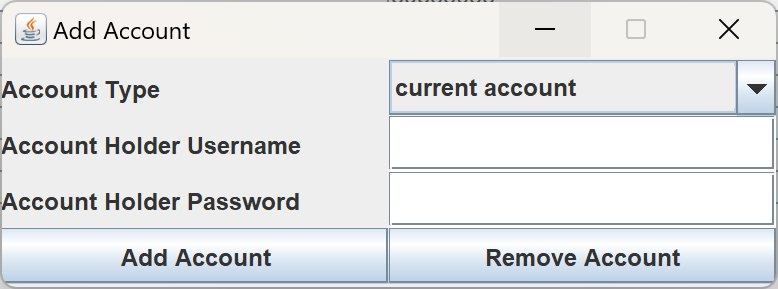

# Virtual Bank For Kids

GitHub repository address:[GitHub - nx-xn2002/VirtualBankForKids](https://github.com/nx-xn2002/VirtualBankForKids)


## How to start

This project was developed using the latest Java LTS version, Java 17, except for Java 21, so please make sure your project environment is running on Java 17.


### Running with the source code

If you want to run the source code, you can open the “VirtualBankForKids” folder as the project directory in your IDE.

Next, run the `main()` method in `com.group20.App`, and you will see the app page.


### Running with the `.jar` package

First, please open the folder containing the `.jar` file using the command prompt, as shown in the screenshot below.


Next, enter the following commands in the command line, and you will see the app page.

```bash
java -jar VirtualBankForKids-1.0.jar
```

**Please keep the command line window open when running the app.**


## Interface display and feature demonstration

### Login Page

When the “Select to register” option is not checked, it is the “Login” function. When checked, it is the “Register” function. Please select the desired function and fill in the corresponding form items according to your needs.


### MainPage

After logging in, you can see the main page of the program. The default page is the UserInfo page. The functional buttons at the top of the page can be clicked to switch to the specified page, and clicking Logout can log out.


### User Info

On this page, you can modify your personal information including password, age, email, and phone number. After making the changes, click the “Update Info” button to save them.


You can manage your family relationships through the “Manage Relation” button. Enter the username, then click “Add Relation” to try adding a family relationship with that user. The “Remove Relation” button can be used to remove a specified relationship.


### Account

On this page, you can view your account information. Each user is allowed to have one saving account and one current account. The saving account is mainly for savings and allows for transfer operations, while the current account is for fund circulation, supporting deposits, withdrawals, and transfers. Children need to open accounts through their parents.


After clicking the “edit account” button, parents will be directed to the corresponding page where they can manage specified user accounts using usernames and passwords, including adding and deleting accounts (**deleting accounts is irreversible**).



### Money

On this page, children can see the payment records of all their accounts, while parents can see the payment records of both their own and their children’s accounts. Meanwhile, users can use the “save” and “withdraw” buttons below to deposit or withdraw money from their current account, and use the “transfer” button to specify transferring money from their account A to the specified account B.


#### save money


#### withdraw money


#### Transfer money

**account id is required!**


### Task

On this page, parents can see all their children's task statuses, and children can see all their own task statuses. Parents can assign tasks to their children (there is no "Create Task" button on the children's page) and manually mark specific tasks as finished.


#### Create Task


#### Finish Task


## Introduction

### Base Requirement

- Java monolithic project + simple GUI, requires offline operation, **web applications are prohibited**.
- use files like `.csv` for data storage, but don't use a database

### Table Design

user Table:

- userId auto increment Integer
- userName
- password
- age
- role 0 - child, 1 - parent
- phone
- email
- createTime
- updateTime

account Table:

- accountId
- userId
- type 0 - current accounts, 1 - saving accounts
- balance 账户余额
- createTime
- updateTime

relation Table:

- relationId
- parentId
- childId
- createTime
- updateTime

money Table:

- moneyId
- type 0 - Withdraw取款,1 - Save存钱, 2 - Transfer转账
- accountIdA
- accountIdB
- amount
- createTime

task Table:

- taskId
- description
- isFinished
- parentId
- childId
- createTime
- updateTime